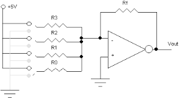
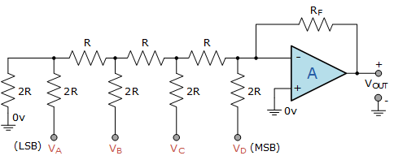
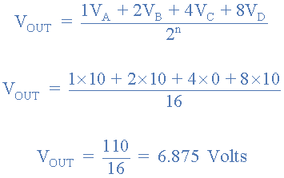

# Control Digital
Se hace una breve introduccion de por que se el control digital dando comparacion con la aplicacion con control analgo, en exactitud, errores de implementacion, flexibilidad, velocidad y costos, tambien se hace una retroalimentacion de lo visto en los cursos anteriores de control.

Abarcamos brevemente la estructura de bloques en control digital, y se empieza la explicacion de el procedimiento para la conversion analoga digital
## 1. ¿Por que control digital.?
## 1.2. Convercion analogico a igital
## 1.2.1. Procedimiento de conversion
## 1.2.1.1 Muestreo
## 1.2.1.2 Cuantizacion
## 1.2.1.3 Codificacion
## 1.3. Conversor digital/analogico
## 1.3.1. Resolucion DAC
## 1.3.2. Metodos de conversion
## 1.4 Modelo matematico

## 2. Definiciones
>🔑*Muestreo:* medir valores cada cierto tiempo, entre mas alta sea la tasa de muestras mas informaciom se procesa y si es muy baja se pierde informacion.
>
>🔑*Cuantizacion:* procesa las señales para reducir la cantidad de datos necesarios para representar una señal.
>
>🔑*Codificacion:* se asignan numeros binarios a cada valor de la cuantizacion.

## 3. Metodos de conversioan
### 3.1 Resistencias ponderadas:
se utilizan para controlar y ajustar la tension y corriente de circuitos, su configuracion es muy facil pero no es muy exacta
 

Figura 1. resistencias ponderadas
### 3.1.2 Red escalera R-2R
Es  efectiva para la convercion digital-analogica ofreciendo una mejor precision, su configuracion en mas comploicada
 

 

Figura 2. R-2R

## 5. Ecuaciones
Para la edición de ecuaciones debe utilizar la etiqueta '$$' al comienzo y final de la ecuación para que la ecuación quede centrada ocupando una línea. Si se quiere que la ecuación quede integrada en el texto debe utilizar la etiqueta '$' al comienzo y final de la ecuación. Las ecuaciones pueden ser editadas utilizando el código LATEX, en el siguiente enlace encuentran un editor de ecuaciones que les genera el código. http://www.alciro.org/tools/matematicas/editor-ecuaciones.jsp . Sin embargo hay muchas otras herramientas que pueden utilizar para esto.

💡**Ejemplo 1:** si se va a representar la ecuación de la ley de Ohm se puede mostrar así $R=\frac{V}{I}$ o también,

$$R=\frac{V}{I}$$

## 7. Tablas
En caso de necesitar la inclusión de tablas para organizar información se recomienda el uso de la herramienta del siguiente enlace https://www.tablesgenerator.com/markdown_tables , la cual permite organizar la información dentro de la tabla y genera el código markdown automáticamente:

💡**Ejemplo 3:** 

| **Resultado** | **x = número de intentos hasta primer éxito** |
|---------------|-----------------------------------------------|
|       S       |                       1                       |
|       FS      |                       2                       |
|      FFS      |                       3                       |
|      ...      |                      ...                      |
|    FFFFFFS    |                       7                       |
|      ...      |                      ...                      |

Tabla 1. Tabla de ejemplo

Cada tabla debe llevar la etiqueta que describa su contenido y numeración consecutiva para todas las tablas

## 9. Ejercicios
Deben agregar 2 ejercicios con su respectiva solución, referentes a los temas tratados en cada una de las clases. Para agregar estos, utilice la etiqueta #, es decir como un nuevo título dentro de la clase con la palabra 'Ejercicios'. Cada uno de los ejercicios debe estar numerado y con su respectiva solución inmediatamente despues del enunciado. Antes del subtitulo de cada ejercicio incluya el emoji 📚

## 10. Conclusiones
Agregue unas breves conclusiones sobre los temas trabajados en cada clase, puede ser a modo de resumen de lo trabajado o a indicando lo aprendido en cada clase

## 11. Referencias
Agregue un subtítulo al final donde pueda poner todas las referencias consultadas incluyendo el origen o fuente de los ejercicios planteados. Tambien dentro del texto referencie los textos o artículos consultados y las figuras y tablas dentro de la explicación de las mismas.
